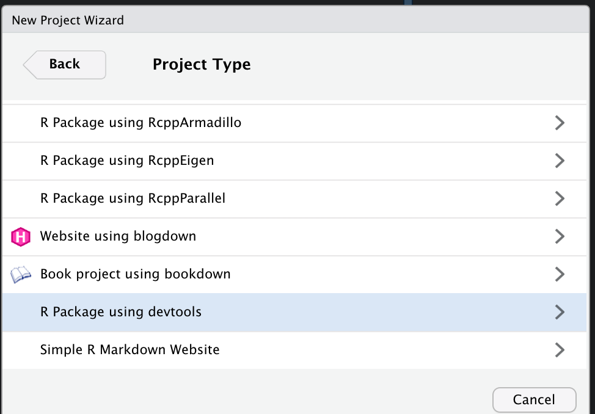
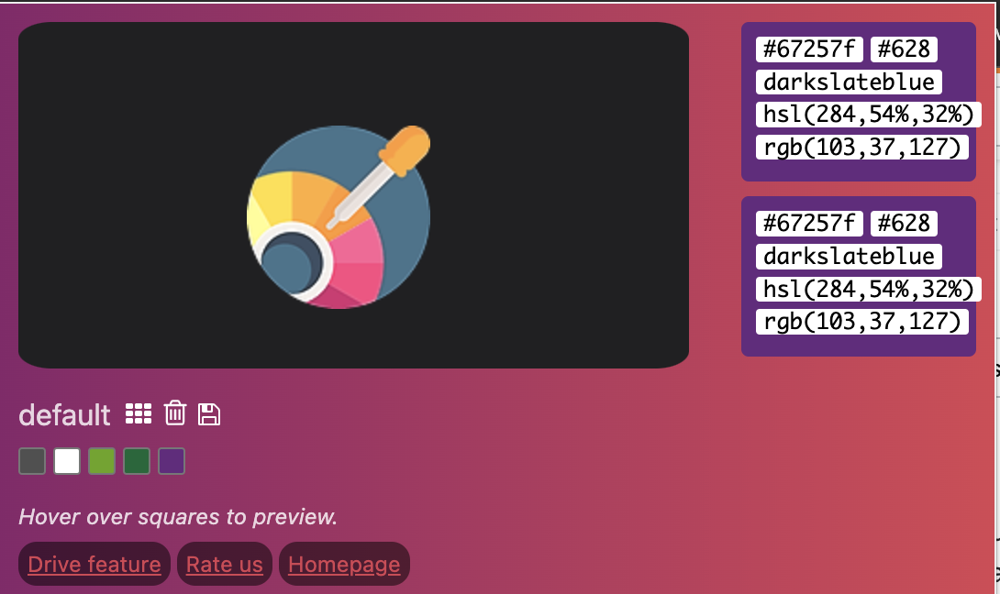

## XXmisc

I see a lot of people host R packages on their GitHub following the naming convention, first initial, last initial, misc. These usually contain a range of functions that are used in day-to-day work, but require some tweaking compared to those readily available through packages on CRAN. Sometimes these are a set of statistical operations for a specific purpose (i.e. dealing with bias in ordered rating scales or for weighting count data given some rate of occurrence). Other times these packages contain custom themes for `ggplot2`, templates, for `beamer` or settings for `xaringan` slides.

In this blog, I'm going to show my workflow as I go about setting up an R package that contains custom themes for `ggplot2` and `xaringan` in the flavor of my new workplace, [Forest Research](https://www.forestresearch.gov.uk/).

## Setting up an R Package

A couple of weeks ago, when I was looking into creating an R package to wrap APIs of the Scottish Parliament, I stumbled on this blog by [Colin Fay](https://colinfay.me/build-api-wrapper-package-r/). While the blog substantively deals with creating a package and functions to download data, there are some great general bits of workflow that speed up package development. This blog borrows heavily from that.

Firstly, make sure you have these packages installed:

```{r eval=FALSE, include=TRUE}

install.packages("devtools")
install.packages("roxygen2")
install.packages("usethis")
devtools::install_github("r-lib/desc")

```

Next we make a new project in RStudio, now that we have `devtools` installed you will see this option after selecting New Directory.



I've named mine `dbmisc`.

In your terminal, run the `use_data_raw()` function from `usethis`. This creates a folder titled `/data_raw` where we can store the below R script which I title "devstuff".

```{r eval=FALSE, include=TRUE}


library(devtools)
library(usethis)
library(desc)

# Remove default DESC
unlink("DESCRIPTION")
# Create and clean desc
my_desc \<- description\$new("!new")

# Set your package name, where I write "dbmisc"

my_desc\$set("Package", "dbmisc")

#Set your name and e-mail
my_desc\$set("Authors\@R", "person('Daniel', 'Braby', email = 'danbraby\@icloud.com', role = c('cre', 'aut'))")

# Remove some author fields
my_desc\$del("Maintainer")

# Set the version
my_desc\$set_version("0.0.0.9000")

# The title of your package
my_desc\$set(Title = "dbmisc")
# The description of your package
my_desc\$set(Description = "This package contains functions and templates that I use for my work.")
# The urls
my_desc\$set("URL", "http://this")
my_desc\$set("BugReports", "http://that")
# Save everyting
my_desc\$write(file = "DESCRIPTION")

# If you want to use the MIT licence, code of conduct, and lifecycle badge
use_mit_license(name = "Daniel Braby")
use_code_of_conduct()
use_lifecycle_badge("Experimental")
use_news_md()

# Get the dependencies
use_package("ggplot2")
use_package("xaringan")
use_package("xaringanthemer")


# Clean your description
use_tidy_description()
```

This is going to do a few things, such as:: adding a name to the package, generating a description which contains the license, import the neccesary packages and create some files and the R folder for writing packages.

## Writing a Xaringan Custom Theme

In the R folder we can begin writing functions, the first we're going to create is `colours.R` this is going to contain a vector with the colours we will include in our `xaringan` and `ggplot2` themes.

But how do we get the colors. There are some R packages which allow the extraction of colours from images, but in my experience these tend to just give shades of white and then require parsing through a dataset of hex colours without an easy way to see what these mean. I much prefer using the chrome extension [Hex Color Picker](https://chrome.google.com/webstore/detail/hex-color-picker/eamkimleiebmdpifljjfilhbaehclahg).

Once this is downloaded and pinned to the toolbar we can use the selection tool to obtain the hex and rgb codes.



Click on the color picker gadget in the black box and the selection tool will appear. On the relevant webpage or image move the cursor over the color and click. The output will then return in the Color Picker App, where we will copy the hex code and use the naming convention (i.e. darkslateblue, as above).


We will write these codes and store them as objects in a file in our `R/` folder under `colours.R` or `colors.R` if you wanna....

```{r eval=FALSE, include=TRUE}

#' Forest Research Colour Palette
#' 
#' This file contains the colours we will use for our ggplot2 and xaringan theme
#' 

forestgreen = "#006937"

olivedrab = "#64a70a"

darkslateblue = "#67257f"

white = "#ffffff"

darkslategray = "#333333"

gray = "#956b9c"

lightgray = "#D3D3D3"

```

Next we will use these colours to create a customised xaringan theme with `xaringantheme`. We will write this function following the naming convention: what for, \_, xaringan. In this case, I'll write `forest_xaringan.R`.

Additionally, I have downloaded two seperate versions of the Department's logo to include in the slides. I save these under a file `img/`, host these on the GitHub repo and call them using their web address.

```{r, eval=FALSE, include= TRUE}

#' Forest Research Xaringan Theme
#' 
#' This file contains a pre-designated theme which can be easily called as a function
#' 
#' @importFrom xaringanthemer style_xaringan
#' 

forest_xaringan <- function(){
  style_xaringan(
  text_color = darkslategray, # Usual text
  header_color = darkslateblue, # Slide heading titles
  background_color = white, # Background Colour
  link_color = olivedrab, # Colour for embedded links
  text_bold_color = forestgreen, # Bold text colour
  code_highlight_color = olivedrab, # Highlighted code
  code_inline_color = darkslateblue, # In line code 
  code_inline_background_color = lightgray, # Background of code
  title_slide_background_color = white, # Title slide Background
  title_slide_text_color = forestgreen, # Text on title slide
  footnote_color = forestgreen # Footnote text colour,
  background_image = "https://github.com/dbrby/dbmisc/blob/master/img/fr_logo.png?raw=true",
    background_position = "left bottom",
    background_size = "10% 10%",
    title_slide_background_image = "https://github.com/dbrby/dbmisc/blob/master/img/fr_logo2.png?raw=true",
    title_slide_background_size = "40% 40%",
    title_slide_background_position = "left bottom"
)
}

```

`style_xaringan()`, previously `write_xaringan_theme()`, generates a customised xaringan theme CSS file which is read in when knitting slides from the `xaringanthemer` template


The CSS file can be stored locally when running the `style_xaringan()` function with `outfile = ""`. However, I prefer to run the custom function `theme_xaringan()` when generating slides myself.

We do this by editing the `{r xaringanthemer}` code chunk at the top of the script. From the `style_duo_accent()` preset to our custom theme, in this case `forest_xaringan()`.

```{r xaringan-themer, include=TRUE, eval=FALSE}

# install.packages("devtools")
# devtools::install_github("dbrby/dbmisc")
require(dbmisc)

forest_xaringan()
```

And when we knit our slides, we get:

### Title Slide


### Regular Slide


## Writing a ggplot2 Theme

`ggplot2` is remarkably extensible and I am yet to fully appreciate the range of changes we can make to a theme. I am a fan of `theme_minimal()` and for now am only looking to make subtle changes to the text featured in my plots.

We can make adjustments to a pre-existent theme using `%+replace%`. Instead of generating a wholly custom theme, this allows specified features to be augmented.

For now I am only going to edit 3 text features, the plot title, subtitle and caption, to include Forest Research flavour. We do this by specifying the element to change within the `theme()` function and specify the size, face, position and colour of the text.

```{r, eval=FALSE, include=TRUE}
#' Custom ggplot Theme in Forest Research Flavor.
#'
#' This is a minimal change to the minimal theme of ggplot2, to position text elements and add some colour.
#' @import ggplot2
#' @export


theme_forest <- function() {
  theme_minimal() %+replace%
    
    theme(
      
      plot.title = element_text(size = 20,
                                face = 'bold',
                                hjust = 0,
                                vjust = 2,
                                colour = forestgreen
    ),
      plot.subtitle = element_text(size = 14,
                                   hjust = 0,
                                   colour = olivedrab),
      plot.caption = element_text(size = 9,
                                hjust = 1,
                                colour = darkslateblue))
    
    
    
}

```

Now adding `theme_xaringan()` to a `ggplot` will generate:


```{r, echo=FALSE, include=FALSE}

require(tidyverse)

```

```{r}

```
